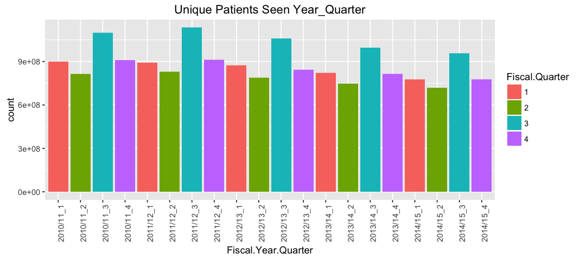
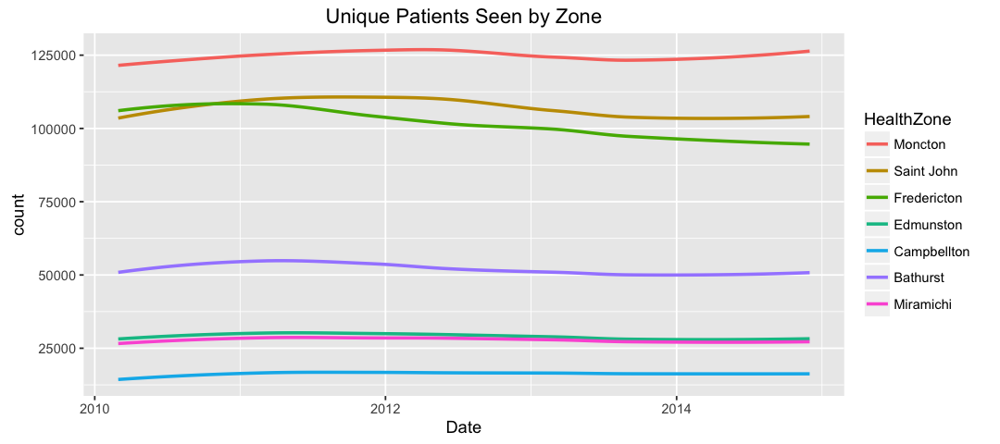
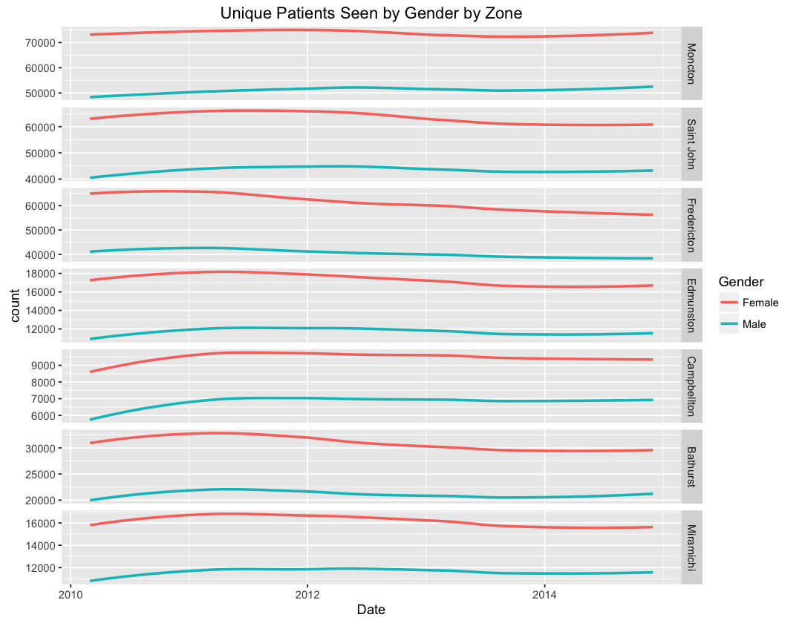
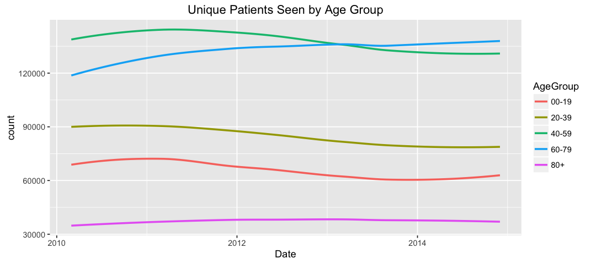
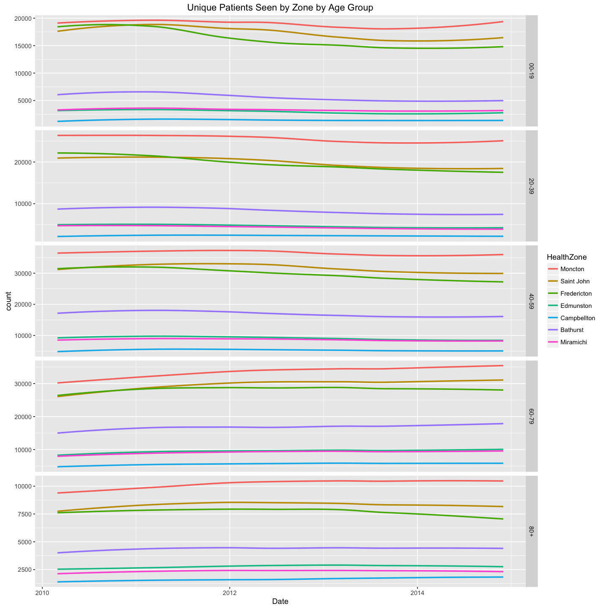
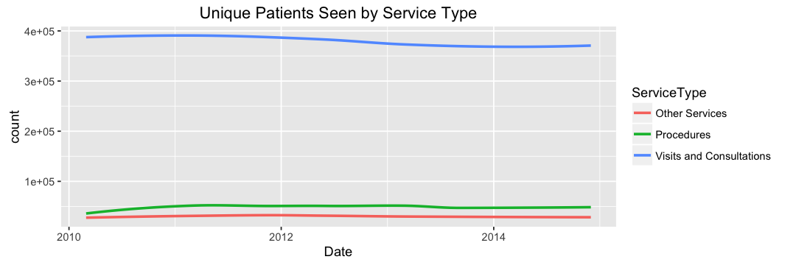
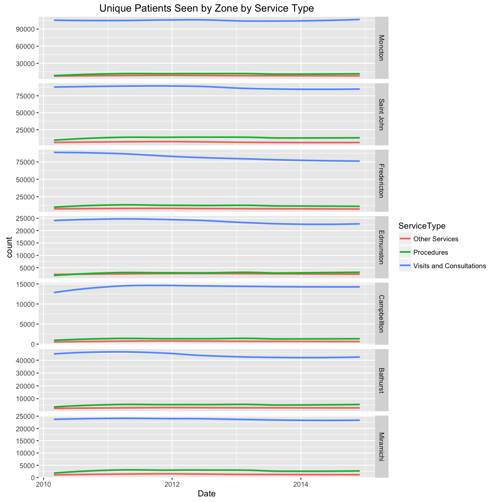
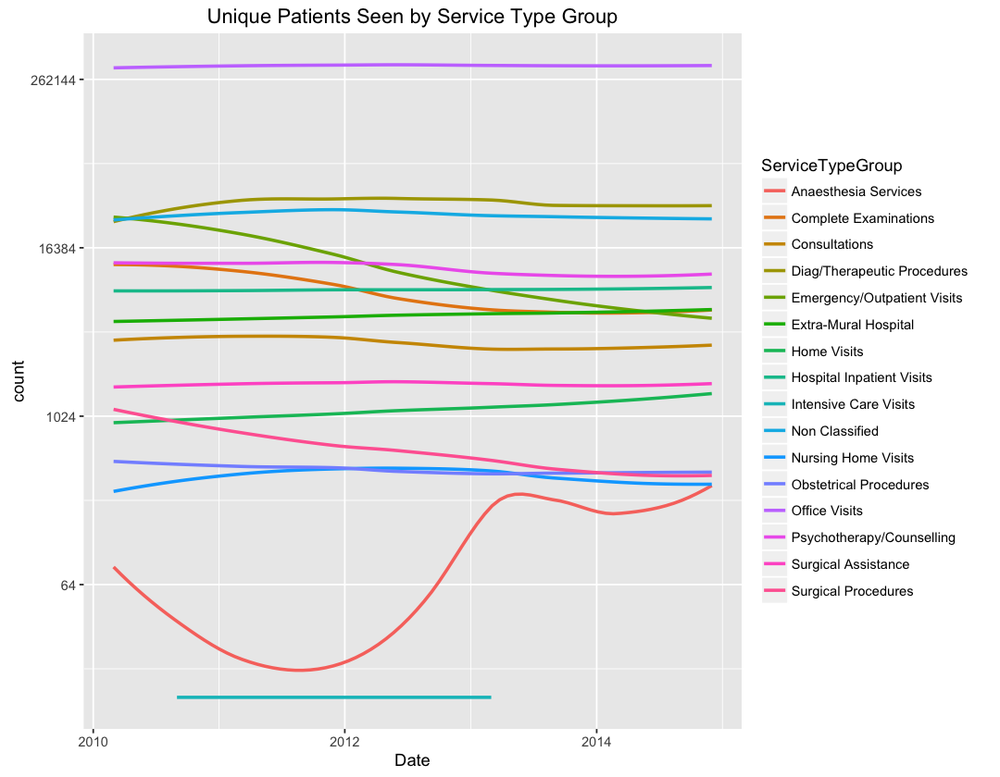

# Family Physician Service Type Utilisation 

## Notes

* __Unique Patients Seen__ totals seen to be consistently over reported in the third quarter and under reported in the second. Subsequent time series plots use smoothing to normalize differences.

## Summaries

### Health zone over time

### Gender over time

### Age group over time

## Service Type over time

## Service Type Group over time

